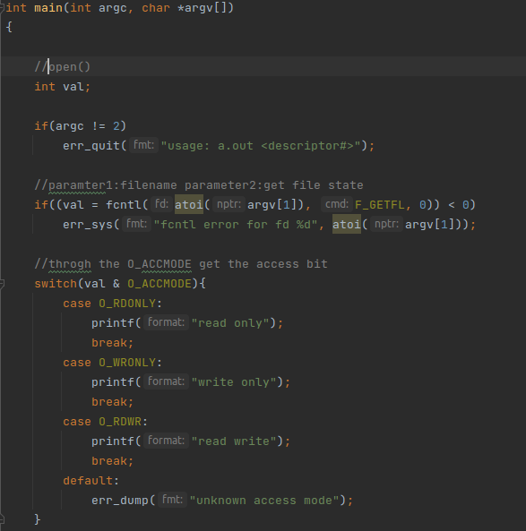

# 文件I/O

可用的文件I/O函数-打开文件、读文件、写文件等。

UNIX系统中的大多数文件I/O只需用到5个函数：open、read、write、lseek以及close。


这些函数是不带缓冲的I/O。

不带缓冲指的是每个read和write都**调用内核中的一个系统调用**。


只要涉及在多个进程间共享资源，原子操作的概念就变得非常重要。


# 文件描述符

对于内核而言，所有打开的文件都通过文件描述符引用。

读、写一个文件时，使用open或create返回的文件描述符标识该文件，

将其作为参数传递给read或write。


UNIX系统shell把文件描述符0与进程的标准输入关联，文件描述符1与标准输出关联，

文件描述符2与标准错误关联。


应该使用STDIN_FILENO、STDOUT_FILENO和STDERR_FILENO以提高可读性，

**这些常量在文件<unistd.h>中定义。**


# 函数open和openat


调用open或者openat函数可以打开或者创建一个文件。


需要包含<fcntl.h>这个头文件。


openat的第一个参数fd，根据两种情况进行区别，如果path参数是相对路径，那么fd代表的是相对路径名在文件系统中的开始地址。

如果path参数是绝对路径，那么fd参数将会被忽略掉。


# 函数create和函数close


# 函数lseek


每个打开文件都有一个与其相关联的"当前文件偏移量"。

用以度量从文件开始处计算的字节数。


读、写操作都是从当前文件偏移量处开始，并使偏移量增加所读写的字节数。


当打开一个文件时，除非指定O_APPEND选项，否则该偏移量被指定为0。


若lseek成功执行，**则返回新的文件偏移量。**

可以用下列方式确定打开文件的当前偏移量：

```c++
off_t currpos;
currpos = lseek(fd, 0, SEEK_CUR);
```


如果文件描述符指向的是一个管道、FIFO或网络套接字，则lseek返回-1，并将errno设置为ESPIPE。


# 函数read


读操作从文件的当前偏移量开始，在成功返回之前，**该偏移量将增加实际读到的字节数。**


# 函数Write

调用Write函数向打开文件写数据。


# 文件共享


Unix系统支持在不同进程间共享打开文件。


内核使用3种数据结构表示打开文件，它们之间的关系决定了**在文件共享方面一个进程对另一个进程可能产生的影响。**


# 原子操作


进程持有一个文件的当前偏移量，同时文件也有一个长度。


早期的时候，open没有O_APPEND选项，所以程序被编写成如下的形式：

```c++
if(lseek(fd, OL, 2) < 0) //to EOF
	err_sys("lseek error");
if(write(fd, buf, 100) != 100) //write
	err_sys("write error");
```


这是两个不同的函数调用，由于内核会临时挂起进程，去切换到另一个进程，导致可能后一个进程会覆盖之前进程的写入。


UNIX为这样的操作提供了原子操作，即在打开文件时设置O_APPEND标志。


## 函数pread和函数pwrite


Single UNIX Specification包括了XSI扩展，该扩展允许原子性地定位并执行I/O。

pread和pwrite就是这种扩展。


原子操作指的是由多步组成的一个操作。


# 函数dup和dup2


用来复制一个现有的文件描述符。


# 函数sync、fsync和fdatasync


带f的函数会在函数执行完成后，里面写入到磁盘中。


# 函数fcntl


fcntl函数可以改变已经打开文件的属性，参数是控制描述符标志的命令。




fcntl的第二个参数，设置为F_GETFL，可以获取文件标志符的状态。


由于O_RDONLY和其它标志符是互斥的，要用O_ACCMODE来获取。


