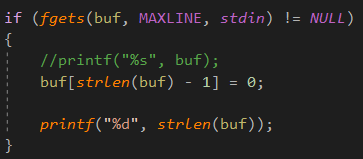

有两种IO，不带缓冲的I/O和带缓冲的I/O。


不带缓冲的I/O，比如read和write，需要提前准备一个数组。

带缓冲的I/O，比如stdin和stdout，不仅不需要提取准备数组，而且还简化了输入行的处理。

而read和write函数是读取字节数。

# 程序和进程

内核使用exec函数，将程序读入内存，并执行程序。


# 进程和进程ID

UNIX系统确保每个进程都有**一个唯一**的数字标识符，称为进程ID(process ID)。

getpid可以返回一个进程ID，类型为pid_t数据类型。


## 进程控制

3个用于进程控制的主要函数：fork、exec和waitpid。

exec函数有7种变体。

fork对父进程返回新的子进程的进程ID(一个非负整数)，对子进程则返回0。

fork创建一个新进程，它被调用一次(由父进程)，但是返回两次(分别在父进程中和在子进程中)。



fgets从标准输入读取一行，strlen不会将最后的\0统计进来的，比如I love you，有10个字符，注意fgets的最后一个字符是\n，如果直接输出长度，是11个，我们要将最后一个字符替换掉。

当键入ctrl + d的时候，fgets返回一个null指针，循环停止。

注意execlp函数要求的参数要以null结束的。

**execlp可以执行从标准输入读取的命令。**

waitpid函数是父进程等待子进程结束的函数。

## 线程和线程ID

一个进程只有一个控制线程(thread)-某一时刻执行的一组机器指令。

一个进程内的所有线程共享同一地址空间、文件描述符、栈以及与进程相关的属性。

**线程ID只在它所属的进程内起作用。**

# 出错处理

UNIX系统函数出错的时候，通常会返回一个负值，有一个整型变量errno被设置为具有特定信息的值。

对于多线程环境，多个线程共享进程地址空间，每个线程都有属于它自己的局部errno，以避免一个线程干扰另一个线程。

```c++
extern int *__errno_location(void);
#define errno (*__errno_location());
```

有两个函数，可以打印出错消息:

```c++
char *strerror(int errnum);

void perror(const char *msg);
```

# 用户标识


登录名:加密口令:数字用户ID:数字组ID:注释字段:起始目录:shell程序

## 用户ID

口令文件中的一行就是一个登录项，用户ID为0的用户为**根用户或超级用户。**

## 组ID

在口令文件中，有多个登陆项具有相同的组ID。

这种机制允许同组的各个成员之间共享资源(如文件)。

组文件将组名映射为数值的组ID，组文件是/etc/group。


磁盘上的每个文件，文件系统都存储该文件所有者的用户ID和组ID。

**组名:密码:组ID:该用户组中的用户列表**

存储这两个值只需要4个字节。

**ls -l命令使用口令文件将数值的用户ID映射为登录名，从而打印出文件所有者的登录名。**


这两个函数可以返回组ID和用户ID。

## 附属组ID

允许一个用户属于另外一些组。

supplementary adj.补充的

# 信号

信号用于通知进程发生了某种情况。

如果一个进程执行除法操作，其除数为0，则将名为SIGFPE(浮点异常)的信号发送给该进程。

进程有3种处理信号的方式:

1.忽略信号。

2.按系统默认方式处理。

3.提供一个函数，信号发送时调用该函数，这种被称为捕获该信号。

# 时间值

日历时间用time_t这种数据类型来保存。

进程时间用clock_t保存。进程时间用**时钟滴答来计数**。

度量一个进程的执行时间时，UNIX系统为一个进程维护了3个进程时间值:

时钟时间

用户CPU时间，执行用户指令所使用的时间。

系统CPU时间，调用系统调用所花的时间。

**可以使用time命令获取时钟时间，用户时间和系统时间。**

# 系统调用和库函数

比如malloc函数，它使用一个系统调用sbrk函数，但是sbrk，并不是一个通用的存储器管理器。

很多软件包，事实上，使用sbrk系统调用实现自己的存储空间分配算法。


